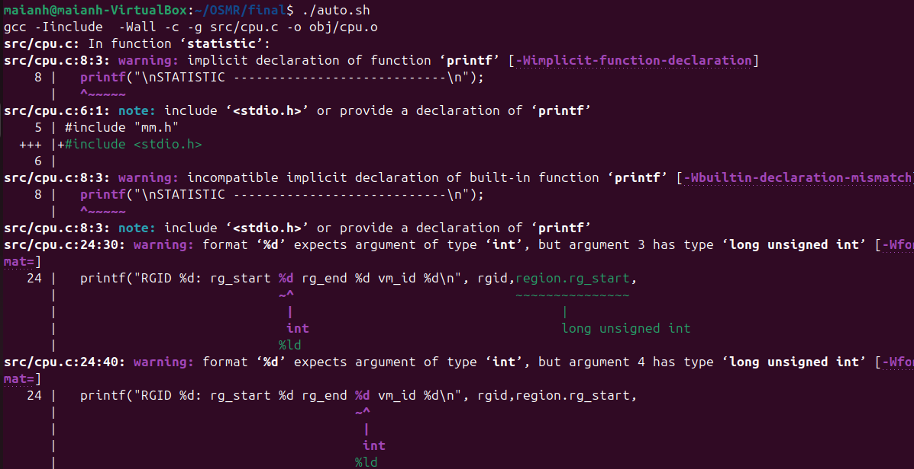

# Program Execution Guide

## Manual Execution Guide

### Steps
1. At the parent directory of `src`, `include`, and `input`, compile the project into an executable binary using the command `make all`. The result will be a runnable program named `os`.

   

   

2. To run any specific testcase described in the `input` directory, use the command `./os [testcase file name]`. For example: `./os tc1`. The execution result will be displayed in the terminal.

   

## Automation Execution Guide

### Steps
1. To run all testcases at once and avoid manually compiling the program after making changes to the source code, use the script `auto.sh`. Grant execution permission to the script with the command `chmod +x auto.sh`.

   

2. Execute the script with the command `./auto.sh`. The program will compile and display the testcases being executed. The results of the testcases will be saved in the `out` directory with names matching the input file names.

   

   

   

## Output Configuration Options
Depending on the level of detail required for task analysis, certain information can be toggled on or off through configuration in `include/os-cfg.h`.

### Options
- **Gantt Chart for Each CPU**: Use `#define SUMMARY` to enable it. To disable, comment out this line.

    
  *When `//#define SUMMARY` is commented out.*

    
  *When `#define SUMMARY` is enabled.*

- **Queue Information Dump for Debugging**: Use the `SCHED_INFO` option to dump detailed information about the queues, aiding in debugging.

---
